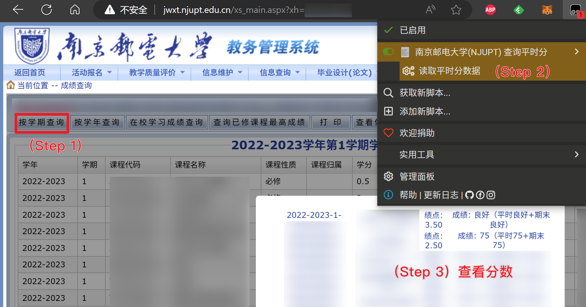

# 南京邮电大学(NJUPT) 查询平时分
**由于教育系统更新，此脚本已失效**

_%E6%9F%A5%E8%AF%A2%E5%B9%B3%E6%97%B6%E5%88%86)  

## 食用说明
1. 使用 Tampermonkey 等用户脚本管理器安装本脚本
2. 登录教务系统，进入成绩查询页面，**进行正常的成绩查询**
3. 点击本脚本的菜单，即可查看平时分

## 许可证
根据 AGPL 3.0 或更高版本许可。详情请参阅 [LICENSE.md](./LICENSE.md)。  
